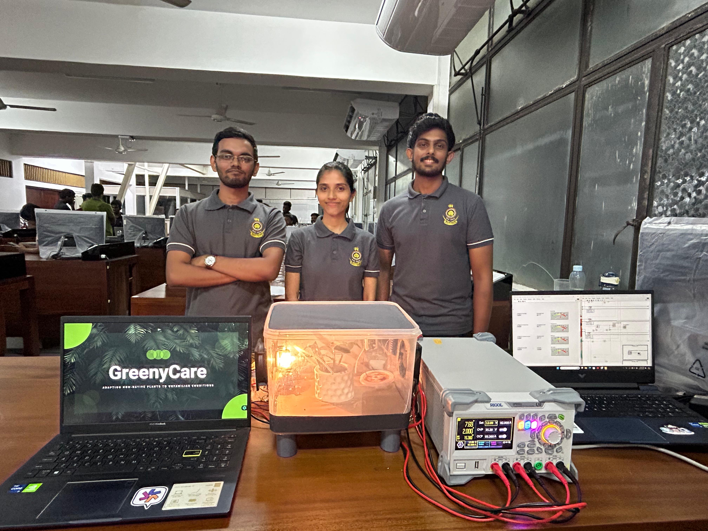
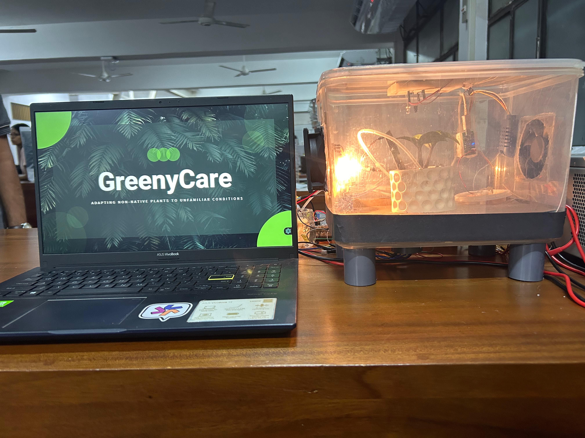

# Greeny Care

## Introduction
Greeny Care is an automated system designed to maintain optimal environmental conditions for plant growth. The system controls humidity, temperature, soil moisture, and monitors the pH level of water before watering the plants. It utilizes various sensors and actuators to create and maintain a suitable environment for plant growth within a fully isolated box.

## System Overview
Greeny Care integrates several sensors and actuators to monitor and adjust the internal environment of the box:

## Our Team


### Sensors Used
- **LM35 Temperature Sensor**: Measures the internal temperature of the box.
- **AMT1001 Humidity Sensor**: Monitors the humidity level inside the box.
- **Capacitive Soil Moisture Sensor**: Checks the moisture level of the soil.
- **pH Sensor**: Measures the pH level of water before it is used to water the plants.
- **Customized IR Sensor**: Measures the growth (height) of the plant.

### Actuators Used
- **12V DC Fans (2)**: Control the temperature by circulating air.
- **Humidifier**: Increases humidity inside the box when levels are low.
- **Halogen Bulb**: Provides heat when the temperature is too low.
- **Water Pump**: Waters the plants when both soil moisture and pH levels are suitable.

## Functionalities

### Environmental Control
- **Temperature Regulation**:
  - If the temperature is high, one DC fan turns on to cool down the environment.
  - If the temperature is too low, the halogen bulb automatically turns on to increase the temperature.

- **Humidity Regulation**:
  - If humidity is low, the humidifier activates to raise the humidity level.
  - If humidity is too high, the second DC fan turns on to expel the moist air and bring in drier air from outside.

- **Soil Moisture Management**:
  - If soil moisture is low, the system checks the pH level of the water.
  - If the pH level is suitable, the water pump activates to water the plants.

### pH Level Monitoring
- The pH sensor checks if the water is within an optimal range for plant growth.
- If the pH level is not desirable, the system alerts the user by turning on an external light.

### Plant Growth Monitoring
- **Customized IR Sensor**: 
  - Measures the height of the plant.
  - Provides data to the user to assess the growth rate and overall health of the plant.
 
 ##Overview


## Installation

### Hardware Setup
1. Assemble the sensors and actuators as per the design.
2. Connect the sensors (LM35, AMT1001, Capacitive Soil Moisture Sensor, pH Sensor, and IR Sensor) to the controller.
3. Connect the actuators (DC Fans, Humidifier, Halogen Bulb, Water Pump) to the controller.
4. Ensure the box is fully isolated from the external environment to maintain controlled conditions.

### Software Setup
1. Clone the repository:
    ```sh
    https://github.com/SamuDitha1/GreenyCare
    ```
2. Upload the provided code to your microcontroller using the Arduino IDE or any compatible IDE.
3. Configure the system parameters such as optimal temperature, humidity, and pH levels in the code.
4. Power on the system and monitor the conditions through the connected sensors.

## Usage
- **Monitoring**: The system continuously monitors temperature, humidity, soil moisture, and pH levels.
- **Automatic Adjustments**: Based on sensor readings, the system automatically adjusts the internal environment using the actuators.
- **User Alerts**: If conditions are not optimal, the system alerts the user through external indicators (e.g., lights).

## Contributions
Feel free to contribute to the development of Greeny Care by submitting pull requests or opening issues in the repository.

## License
This project is licensed under the MIT License. See the [LICENSE](LICENSE) file for details.

## Contact
For any questions or feedback, please contact [yourname@yourdomain.com](mailto:yourname@yourdomain.com).

